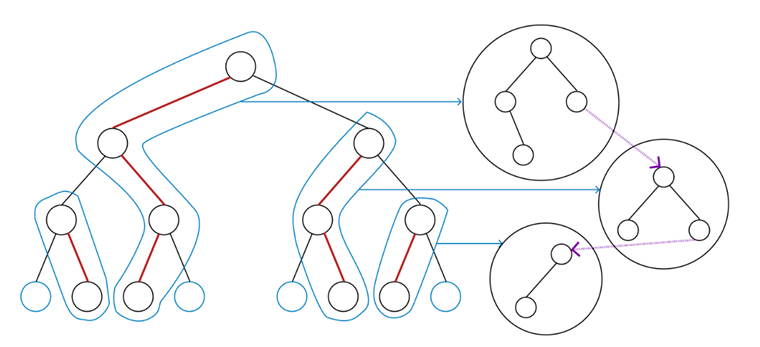

#Tango tree
##Содержание:
[1  Введение](#intro)
[2	Описание алгоритма](#k)
*   [2.1  Tango tree](#tango)
*   [2.2	Вспомогательные деревья](#a_tree)
*   [2.3	Операции слияния и разделения во вспомогательных деревьях](#operations)
*   [2.4	Операция поиска в Tango дереве](#find)

[3	Реализация](#upd)
*   [3.1	Splay-дерево](#splay)
*   [3.2	Описание реализации](#r)
*   [3.3	Функции, используемые в реализации](#f)
*   [3.4	Обращение к элементу (поиск)](#fr)

[4	Тестирование](#test)
[5	Список литературы](#info)


<a name="intro"></a>
##1 Введение
В 2004 году четверо ученых, Эрик Д. Демейн, Дион Хармон, Джон Яконо и Михаи Патраску, разработали Tango дерево. Назвали его в честь города Буэнос-Айреса, символом которого является танго.


Tango tree — сбалансированное бинарное дерево поиска. Дерево представляет собой созданные и объединенные по некоторому принципу вспомогательные деревья. Tango дерево поддерживает операцию поиска и операции разделения и слияния вспомогательных деревьев. Изначально в качестве вспомогательных деревьев использовались красно-черные, но последующие реализации использовали уже модифицированные splay деревья, так как это было эффективнее по времени.

<a name="k"></a>
##2 Описание алгоритма
<a name="tango"></a>
###2.1  Tango tree
Рассмотрим бинарное дерево поиска. 
Мы определяем левый дочерний элемент предпочтительным элементом узла x, если к левому поддереву x обращались в последнюю очередь, или правый дочерний элемент, если к правому поддереву x обращались в последнюю очередь. Если не было обращений ни к одному из поддеревьев, то базовое значение предпочтительного элемента “none”.


Предпочтительные пути образуют цепочки по всему дереву, и мы можем группировать узлы в эти цепочки и сохранять каждую цепочку как самостоятельное красно-черное дерево с указателями между ними, от одного дерева к другому.





Красно-черные деревья выполняют операции вставки, удаления и поиска за время O(logn).


Чтобы найти нужный нам узел, мы начинаем поиск с самого верхнего вспомогательного дерева (того, которое содержит корень основного дерева) и спускаемся вниз. Мы совершаем k переходов через вспомогательные деревья, что приводит к k · O(loglogn) операциям поиска.


Поскольку предпочтительные ребра представляют собой узлы, к которым были применены последние обращения, то после каждого поиска нам необходимо обновлять предпочтительные ребра. Это изменение реализуется «срезанием» одного пути и объединением двух других. Из-за необходимости постоянного обновления указателей, при каждом поиске происходит постоянное число операций разделения и объединения двух красно-черных деревьев. Поскольку каждое вспомогательное дерево имеет O(log(n)) узлов, а операции разделения и объединения занимают log(Height) для красно-черного дерева, то изменение предпочтительного дочернего элемента занимает O(log(log(n))) времени.
Учитывая обновление предпочтительных ребер, поиск элемента в Tango tree занимает время (k + 1) · O(loglogn). 

<a name="a_tree"></a>
###2.2	Вспомогательные деревья
Вспомогательное дерево представляет собой модифицированное бинарное дерево поиска (это может быть, в зависимости от реализации, красно-черное или splay дерево), в котором хранится предпочтительный путь, но упорядоченный по значению ключа. В каждом узле мы также сохраняем его фиксированную глубину в основном дереве. Таким образом, глубины узлов во вспомогательном дереве образуют подинтервал [0, lg(n)]. Самый верхний узел называется вершиной(началом) пути, а самый глубокий – концом пути. 
Необходимы следующие операции во вспомогательном дереве:
1.	Поиск элемента по ключу во вспомогательном дереве
2.	Разрезание вспомогательного дерева на два вспомогательных дерева, одно из которых хранит путь ко всем узлам глубины не более указанной глубины d, а другое хранит путь ко всем узлам глубины, превышающей d.
3.	Объединение двух вспомогательных деревьев, которые хранят два непересекающихся пути, где нижняя часть одного пути является родительской для верхней части другого пути.

Также для эффективности tango дерева, требуется, чтобы все эти операции занимали время O(lgk), где k - общее количество узлов во вспомогательном дереве (деревьях), участвующих в операции.
Под эти критерии подходит и красно-черное дерево(первые реализации) и splay дерево(другой способ реализации).
Рассмотрим реализацию с красно-черным деревом, впрочем, реализация с деревом splay не отличается. В дополнение к хранению значения ключа и глубины каждый узел сохраняет минимальную и максимальную глубину узлов в своем поддереве. Эти данные могут быть легко сохранены в узлах. Дополнительная сложность заключается в том, что узлы, в которых обычно отсутствует дочерний элемент в красно-черном дереве, например листья, могут иметь дочерние указатели, которые указывают на другие вспомогательные деревья. Чтобы различать вспомогательные деревья мы отмечаем корень каждого вспомогательного дерева.

<a name="operations"></a>
###2.3	Операции слияния и разделения во вспомогательных деревьях
Используются следующие определения операций слияния и разделения вспомогательных деревьев:
1.  Разделение дерева на узле x: дерево перестраивается так, чтобы x было в корне, левое поддерево x — это дерево с ключами меньше x, а правое поддерево x — это дерево с ключами больше x.
2.  Объединение двух деревьев: объединяются два дерева поиска, где все ключи одного дерева меньше, чем ключи другого, в единое дерево.
Эти операции не прикасаются к тем узлам, в которых начинаются другие вспомогательные деревья.

Теперь опишем, как поддерживать разрезание и объединение с помощью split и concatenate.
Чтобы разрезать расширенное дерево A на глубине d, сначала обратим внимание, что узлы глубиной больше d образуют интервал ключей внутри A. Используя максимальную глубину каждого поддерева, мы можем найти узел l с минимальным значением ключа, который имеет глубину больше d за O (lgk) время, начиная с корня и многократно переходя к крайнему левому дочернему элементу, поддерево которого имеет максимальную глубину, превышающую d. Также мы можем найти узел r с максимальным значением ключа, глубина которого больше d. Мы также вычисляем предка l' из l и потомка r' из r.


Используя интервал [l, r], что эквивалентно интервалу (l', r'), определяющий интересный нам диапазон, мы манипулируем деревьями, используя split и concatenate, как показано на рисунке.
Сначала мы разделяем A по l', чтобы сформировать два поддерева B и C из l', соответствующих отрезкам значений ключей (−∞, l') и (l', ∞). (Мы пропускаем этот шаг и последующее объединение по l', если l' = ∞)


Затем мы разделяем C по r', чтобы сформировать два поддерева D и E из r', соответствующих отрезкам значений ключей (l', r') и (r', ∞). (Мы пропускаем этот шаг и последующее объединение по r', если r' = ∞)


Теперь мы отмечаем корень дерева D, отделяя D от оставшегося дерева. Элементы в D имеют ключи в диапазоне (l', r'), что эквивалентно диапазону [l, r], которые точно являются узлами с глубиной, большей, чем d.
Затем мы объединяем по r', который не имеет левого дочернего элемента, таким образом, объединение просто формирует дерево по r' и узлы в его правом поддереве.


Наконец, мы объединяем по l', объединяя все узлы, кроме тех, что находятся в дереве D. Таким образом, итоговое дерево содержит все узлы глубиной не более d.


Объединение двух вспомогательных деревьев A и B аналогично, за исключением того, что мы снимаем пометку вместо создания пометки.
Сначала мы определяем, в каком дереве хранятся узлы с глубиной, большей, чем у всех узлов в другом дереве, сравнивая глубины корней A и B.


Предположим, что A хранит узлы большей глубины. Обратим внимание, что узлы в B имеют значения ключей, находящиеся между двумя соседними ключами l' и r' в A. Мы вы можете найти эти ключи, выполнив поиск в A по ключу корня B. 
Если мы разделим A по l', а затем по r' (пропуская разделение и последующее объединение в случае исключений), то отмеченный корень B станет левым дочерним элементом r'. Затем мы снимаем пометку с корня B, объединяем по r', а затем объединяем по l'. 
Результатом будет являться единое дерево, содержащее все элементы из A и B.

<a name="find"></a>
###2.3	Операция поиска в Tango дереве
Поиск в дереве Tango очень похож на таковой в бинарном дереве поиска. 
Сначала находим предпочтительный путь, который начинается в корне дерева, просматриваем его вспомогательное дерево. 
Если узел не был найден в заданном вспомогательном дереве, то ищем вспомогательное дерево следующего пути и так далее до перебора всего дерева. После поиска мы перереназначаем предпочтительные узлы и перестраиваем вспомогательные деревья.

<a name="upd"></a>
##3	Реализация
В этой реализации в качестве вспомогательных деревьев будут использоваться Splay деревья. Поэтому кратко опишем основные характеристики этого дерева и функции, которые будут использоваться.

<a name="upd"></a>
###3.1	Splay-дерево
Splay-дерево — это самобалансирующееся бинарное дерево поиска. Дереву не нужно хранить никакой дополнительной информации, что делает его эффективным по памяти. После каждого обращения, в нашем случае после поиска, splay-дерево меняет свою структуру.


Смена структуры заключается в том, что после обращения к любой вершине, она поднимается в корень. Подъем реализуется через повороты вершин. За один поворот, можно поменять местами родителя с ребенком.  


Но просто поворачивать вершину, пока она не станет корнем, недостаточно. Смысл splay-дерева в том, что при продвижении вершины вверх, расстояние до корня сокращается не только для поднимаемой вершины, но и для всех ее потомков в текущих поддеревьях. Для этого используется техника zig-zig и zig-zag поворотов.
Основная идея zig-zig и zig-zag поворотов, рассмотреть путь от дедушки к ребенку. Если путь идет только по левым детям или только по правым, то такая ситуация называется zig-zig. Сначала нужно повернуть родителя, потом ребенка.


В противном случае, мы сначала меняем ребенка с текущим родителем, потом с новым.


Если у вершины дедушки нет, то делаем обычный поворот.  


Процедура поиска в splay-дереве отличается от обычной только на последней стадии: после того, как вершина найдена, мы тянем ее вверх и делаем корнем, как описывалось ранее.

<a name="r"></a>
###3.2	Описание реализации 
Реализация по большей части не отличается от ранее описанного теоритического варианта.


В структуре данных Tango tree предполагается исходное дерево, которое является идеально сбалансированным, состоящее из n узлов. У каждого узла есть предпочтительный дочерний элемент. Путь, состоящий из предпочтительных потомков различных узлов называется предпочтительным путем. Исходное дерево необходимо только для понимания и не присутсвует в реализации.


На схеме изображено дерево Tango. 
Набор узлов, соединенных сплошными линиями, — это вспомогательное Splay дерево.
Пунктирные линии – соединение вспомогательных деревьев.


  

<a name="f"></a>
###3.3	Функции, используемые в реализации
* explore() — вспомогательная функция, которая отображает все дерево.
* treeFor() - функция создания дерева.
* rotate() - функция для выполнения операции вращения.
* splay() - функция для выполнения операции расширения.
* switchPath() — функция для установки значений depth и minDepths в узлах.
* refParent() — функция для возврата первого дочернего элемента, значение minDepth которого больше значения depth.
* expose() - функция для переноса текущего узла в корень всего дерева.
* query() - функция для доступа к элементу в дереве Tango.  

<a name="fr"></a>
###3.4	Обращение к элементу (поиск)
Мы вызываем функцию query() для доступа к необходимому узлу в Tango Tree. Затем функция "поднимает" узел вверх по дереву до тех пор, пока он не достигнет корня Tango Tree.


При первом "поднятии" узел перемещается в корень Splay дерева, которому он принадлежит, путем выполнения необходимых поворотов.
После этого, используются фунции refParent() и switchPath(), выполняется дальнейшая процедура "поднятия" узла.


Выполнение функции поиска завершается, когда родитель узла к которому осуществляется доступ, имеет значение NULL, то есть узел, к которому осуществляется доступ, является корнем Tango дерева.
query() использует функцию expose(), которая, в свою очередь, использует splay(), rotate(), refParent() и switchPath().  

Псевдокод query():
```    
Ищем, пока не найдем либо ключ, либо NULL
Операция поиска аналогична поиску в бинарном дереве.
curr = current node
prev = parent of curr
if curr == NULL:
    expose(prev)
    return false
expose(curr)
return true
```

Псевдокод expose():
```
while node->parent != NULL:
    play(node)
    update depths and minDepths
return
```  

<a name="test"></a>
##4	Тестирование
Оценка производительности выполнена на 3 наборах данных разной размерности (500, 50000, 5000000).


Были выполнены запросы элементов в порядке возрастания, обратном порядке, в случайном порядке. И запросы одного и того же элемента, для проверки перестройки дерева.


Таблица содержит приблизительное время создания дерева и поиска в нем элементов. Сколько элементов, столько и операций поиска.


Самый длительный поиск – это поиск случайного элемента, это предсказуемо потому что к данному типу в этом дереве никаких оптимизаций не применено.


Обратный поиск примерно равен по времени поиску в порядке возрастания.


Поиск одного и того же числа оказался самым быстрым, потому что еще при первой операции поиска дерево перестроилось и это число стало корнем.


<a name="info"></a>
##5	Список литературы
* [Lecture: Competitive analysis of data structures](https://www.cs.princeton.edu/courses/archive/fall08/cos521/tango.pdf)
* [Dynamic optimality — Almost](http://erikdemaine.org/papers/Tango_SICOMP/paper.pdf)
* [Lecture: Competitive Dynamic BSTs](https://jeffe.cs.illinois.edu/teaching/datastructures/notes/03-wilber-tango.pdf)
* [Dynamic Optimality and Tango Trees](https://nikhilsardana.github.io/tango.pdf)